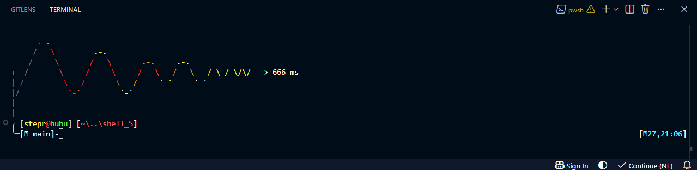

# shell_S

**shell_S** — минималистичная тема **Oh My Posh** для **PowerShell 7** с анимированным запуском, градиентом, звуком и отдельной настройкой для **VS Code**.




---

## Возможности

- минималистичный PowerShell-профиль
- тема Oh My Posh с блоками:
  - пользователь
  - хост
  - короткий путь
  - Git-статус
  - время справа
- анимированное приветствие при запуске
- плавный heat-gradient
- пропуск анимации клавишей **Space**
- звук запуска `startup.wav`
- безопасная остановка звука при закрытии PowerShell
- автоматический поиск файлов рядом с профилем
- кэширование Oh My Posh для быстрого старта
- ленивая загрузка `Terminal-Icons`
- удобные алиасы:
  - `..`
  - `...`
  - `~`
  
---

## Требования

| Компонент | Ссылка |
|---|---|
| PowerShell 7 | https://github.com/PowerShell/PowerShell |
| Oh My Posh | https://ohmyposh.dev/docs/installation/windows |
| Terminal-Icons | https://github.com/devblackops/Terminal-Icons |

---

## Структура проекта

```text
shell_S/
├─ PROFILE
├─ Microsoft.VSCode_profile.ps1
├─ shell_S.omp.json
├─ startup.wav
├─ start1.gif
└─ vs_code.png
```

---

## Установка

### 1. Склонируйте репозиторий

```powershell
git clone https://github.com/kictak/shell_S.git
cd shell_S
```

### 2. Откройте основной профиль PowerShell

```powershell
notepad $PROFILE
```

Если файл ещё не существует, PowerShell создаст его автоматически.

### 3. Скопируйте содержимое файла `PROFILE`

Откройте файл из репозитория:

```powershell
notepad .\PROFILE
```

Скопируйте весь текст и вставьте его в открытый `$PROFILE`.

### 4. Положите файлы рядом с профилем

Откройте папку профиля:

```powershell
explorer (Split-Path $PROFILE)
```

Скопируйте туда:

- `shell_S.omp.json`
- `startup.wav`

После этого рядом с профилем должны лежать такие файлы:

```text
Documents\PowerShell\
├─ Microsoft.PowerShell_profile.ps1
├─ shell_S.omp.json
└─ startup.wav
```

### 5. Перезапустите PowerShell

Либо примените профиль вручную:

```powershell
. $PROFILE
```

---

## Отдельно для VS Code

VS Code использует свой профиль PowerShell, поэтому для одинакового внешнего вида нужно создать отдельный файл-мостик.

### Создайте файл `Microsoft.VSCode_profile.ps1`

```powershell
notepad $env:USERPROFILE\Documents\PowerShell\Microsoft.VSCode_profile.ps1
```

### Вставьте в него

```powershell
# Мостик к основному профилю shell_S
. "$env:USERPROFILE\Documents\PowerShell\Microsoft.PowerShell_profile.ps1"
```

После этого терминал в VS Code будет использовать тот же профиль, что и обычный PowerShell.

---

## Как это работает

Профиль автоматически ищет файлы рядом с собой:

```powershell
$ompConfig = Join-Path $PSScriptRoot "shell_S.omp.json"
$soundPath = Join-Path $PSScriptRoot "startup.wav"
```

Это удобно, потому что:

- можно запускать PowerShell из любой папки
- тема всегда находится автоматически
- звук всегда находится автоматически
- не нужно вручную редактировать пути

---

## Пропуск анимации

Во время запуска нажмите **Space** — оставшаяся часть баннера появится сразу.

---

## Звук запуска

По умолчанию используется:

```text
startup.wav
```

Файл должен лежать рядом с профилем.

### Добавить свой звук

Поддерживается PCM WAV.

```powershell
ffmpeg -i "my.mp3" -acodec pcm_s16le -ar 44100 "startup.wav"
```

Положите получившийся файл рядом с профилем.

### Отключить звук

Закомментируйте строку с путём к `startup.wav` в профиле.

---

## Частые ошибки и решения

### 1. Ошибка темы Oh My Posh: `CONFIG PARSE ERROR`

#### Симптомы

- вместо минималистичного промпта `╭─` / `╰─` показывается стандартный powerline
- в терминале появляется ошибка `CONFIG PARSE ERROR`

#### Причина

В файле `shell_S.omp.json` у сегмента `path` был лишний параметр `style` внутри `properties`.

#### Неправильно

```json
{
  "foreground": "#ff5555",
  "style": "plain",
  "properties": {
    "style": "agnoster_short"
  },
  "template": "<#ffffff>[</>{{ .Path }}<#ffffff>]",
  "type": "path"
}
```

#### Правильно

```json
{
  "foreground": "#ff5555",
  "style": "plain",
  "template": "<#ffffff>[</>{{ .Path }}<#ffffff>]",
  "type": "path"
}
```

После исправления перезапустите PowerShell.

---

### 2. В VS Code тема выглядит иначе

#### Симптомы

- другой промпт
- нет анимации
- нет звука
- алиасы не работают так же, как в обычной консоли

#### Причина

VS Code использует отдельный профиль:

```text
Microsoft.VSCode_profile.ps1
```

#### Решение

Создайте файл:

```powershell
notepad $env:USERPROFILE\Documents\PowerShell\Microsoft.VSCode_profile.ps1
```

И вставьте:

```powershell
# Мостик к основному профилю shell_S
. "$env:USERPROFILE\Documents\PowerShell\Microsoft.PowerShell_profile.ps1"
```

---

## Дополнительно

### Убрать стандартный баннер PowerShell

В Windows Terminal откройте настройки профиля PowerShell и укажите:

```powershell
pwsh.exe -NoLogo
```

### Изменить скорость анимации

Найдите строку:

```powershell
for ($w = 0; $w -lt 6000; $w++) { }
```

- меньшее значение — быстрее
- большее значение — медленнее
- если удалить строку, запуск будет мгновенным

### Обновить репозиторий

```powershell
cd shell_S
git pull
```

---

## Файлы

| Файл | Назначение |
|---|---|
| `PROFILE` | основной профиль PowerShell |
| `VS_CODE_PROFILE` | профиль для VS Code |
| `shell_S.omp.json` | тема Oh My Posh |
| `startup.wav` | звук запуска |
| `start.gif` | демонстрация запуска |
| `vs_code.png` | демонстрация в VS Code |

---

Сделано для **PowerShell 7** + **Windows Terminal** + **VS Code**